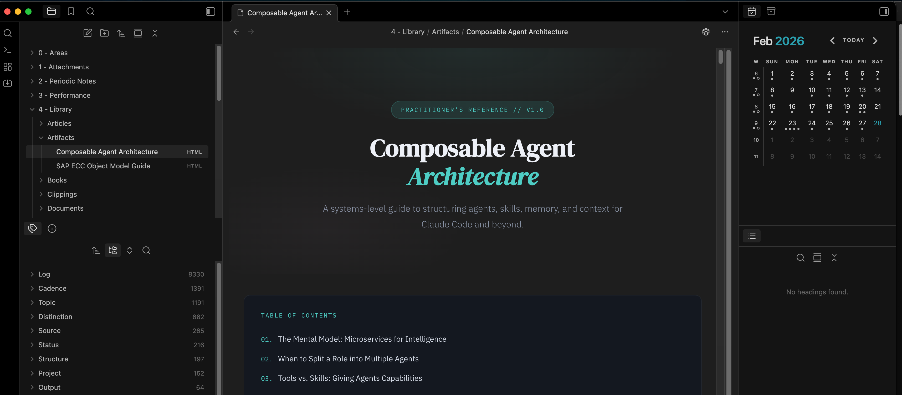

# Lightweight HTML Reader

An Obsidian plugin that lets you read `.htm`, `.html`, `.jsx`, and `.tsx` files directly in your vaults. 



## Features

- **Native HTML rendering** — open HTM/HTML files as a tab. No external dependencies
- **Standalone React component rendering** — open JSX and TSX files that export a React component or React element and render them locally inside Obsidian.
- **Configurable security modes** — choose how aggressively content is sanitized:
  - **Restricted** — strips scripts, styles, forms, iframes, and inline event handlers.
  - **Balanced** (default) — strips scripts and dangerous elements but preserves CSS styles.
  - **Unrestricted** — renders HTML as-is with no sanitization.
- **Optional script execution** — in unrestricted mode, you can allow JavaScript to run for sandboxed HTML rendering and standalone JSX/TSX components.
- **Local-only JSX runtime** — bundles a React-compatible runtime and a small JSX transformer so standalone component files render without a remote service or external build step.
- **Dark mode support** — automatically injects dark-mode-friendly styles so HTML pages look comfortable in dark themes.
- **Cross-platform** — HTML uses a sandboxed `<iframe>` on desktop and a Shadow DOM renderer on mobile, while JSX and TSX files render through a local React root.


## Setup

Before using the plugin, Obsidian needs to be configured to detect and display non-markdown file types.

### 1. Enable file detection

Go to **Settings → Files and links → Show all file types**. Turn this on so Obsidian recognizes `.htm`, `.html`, `.jsx`, and `.tsx` files in your vault.

### 2. Sync supported files (Obsidian Sync users)

If you use Obsidian Sync, go to **Settings → Sync → Selective sync** and enable **Sync all other types**. This ensures your HTML and JSX files are synced across devices.

## Installation

### From community plugins

Search for **Lightweight HTML Reader** in **Settings → Community plugins → Browse** and install.

### Manual

1. Build the plugin (see below) or download `main.js`, `manifest.json`, and `styles.css` from a release.
2. Copy those files into your vault at `<Vault>/.obsidian/plugins/lightweight-html-reader/`.
3. Reload Obsidian and enable the plugin in **Settings → Community plugins**.

## Development

Requires Node.js 18+.

```bash
npm install
npm run dev      # watch mode
npm run build    # production build
```

## Settings

| Setting | Description | Default |
|---|---|---|
| Security mode | Controls HTML sanitization level (Restricted / Balanced / Unrestricted) | Balanced |
| Allow scripts | Allow JS execution for unrestricted HTML files and standalone JSX/TSX component files | Off |
| Dark mode support | Inject dark mode styles into rendered HTML | On |

## JSX and TSX files

Standalone JSX and TSX files are rendered locally with a React-compatible runtime when they export a component or a React element. To run them:

1. Set **Security mode** to **Unrestricted**.
2. Turn on **Allow scripts**.
3. Open a `.jsx` or `.tsx` file from the vault.

Current JSX support is intentionally small and local-first:

- Files should be self-contained and export a default component, `App`, or a React element.
- Imports are limited to `react`.
- No remote bundling, CDN imports, or extra build step is required.

Example:

```jsx
import {useState} from "react";

export default function Counter() {
	const [count, setCount] = useState(0);

	return (
		<main style={{padding: 24}}>
			<h1>Hello from Obsidian</h1>
			<button onClick={() => setCount(count + 1)}>
				Clicked {count} times
			</button>
		</main>
	);
}
```


## License

[0-BSD](https://opensource.org/license/0bsd)
